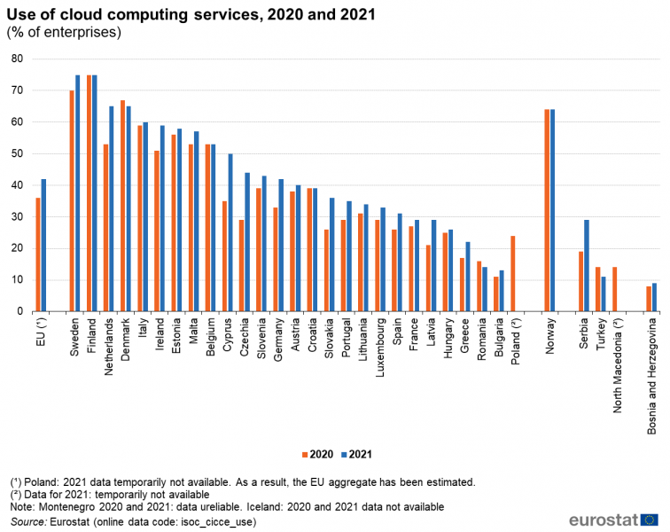

# Analysis of security and privacy threats in the cloud, countermeasures adopted and how the blockchain can help

### Abstract 
The Cloud Computing paradigm is considered one of the most important paradigm shifts, in the technological field, in recent years. Its remarkable growth is mainly due to the opportunity it offers users to reduce costs and at the same time increase the efficiency of applications by providing a new approach to using services. In fact, one of the main features of the Cloud is the ability to pay only for the resources actually used and thus avoid large initial investments. However, despite the numerous advantages offered, there are still possible security threats that are perceived as the main obstacle to the massive adoption of the Cloud. In this study we analyze the main security and privacy threats in the Cloud, and the related countermeasures adopted to achieve a reliable Cloud environment. In particular, we will refer to the security mechanisms used by the most used Cloud Providers: Amazon Web Services and Microsoft Azure. Furthermore, a real case study of an attack on a Cloud Provider will be presented with the relative details to understand the level of associated risk, and finally we will make an overview on the use of the blockchain in combination with the Cloud to understand which added values it manages to achieve.

## Index

### 1. [Introduction on Cloud and Cloud Security](#chap1)
- What is the Cloud in short 
- Some Statistics
- The main benefits of the Cloud
- Introduction to Cloud Security
  - Extensibility & Shared Responsibility
  - Service Level Agreement (SLA)

### 2. [Security and Privacy threats in the Cloud](#chap2)
- Threats Agents
- Outsourcing of data and computation
  - Traffic Eavesdropping
  - Malicious Intermediary
- Denial of Service
- Authentication and Identity Management
  - Insufficient Authorization
- Virtualization Attack
- Trust Management 
  - Overlapping Trust Boundaries
- Privacy and Data Protection
- Security Policy Disparity
  
### 3. [Countermeasures to Cloud Security Threats](#chap3)
- Encryption + type of encryption used in cloud
- Hashing
- Digital Signature
- Public Key Infrastructure (PKI)
- Identity and Access Management
- Single Sign-on (SSO)
- Cloud-Based Security Groups
- Hardened Virtual Server Images

### 4. [Security services of the main Cloud Providers](#chap4)
- Usage statistics of the main Cloud Providers
- Overview of the mechanisms adopted by AWS (Amazon Web Services)
- Overview of mechanisms adopted by Microsoft Azure
  
### 5. [Analysis of a real case study: attack to Tesla](#chap5)
- Details of the attack
- Impact of the attack
- Preventive mitigation actions
- Investigative mitigation actions
- Corrective mitigation actions

### 6. [Blockchain and Cloud Security](#chap6)
- x
- y

### 7. [Conclusions](#conclusions)

## 1. Introduction on Cloud and Cloud Security 

#### What is Cloud in short
The US National Institute of Standards and Technology (NIST) defines the Cloud as follows:

*"Cloud computing is a model for enabling ubiquitous, convenient, on-demand network access to a shared pool of configurable computing resources (e.g., networks, servers, storage, applications, and services) that can be rapidly provisioned and released with minimal management effort or service provider interaction".*

#### Some statistics
According to predictions from Gartner, global spending on cloud services is expected to reach over $482 billion in 2022, up from $313 billion in 2020. Cloud computing infrastructure is the backbone of the delivery pipeline of just about every digital service, from social media and streaming entertainment to connected cars and autonomous internet of things (IoT) infrastructure. New or upcoming ultra-fast networks like 5G and Wi-Fi 6E don't just mean more data will be streamed from the cloud; they mean new types of data can be streamed. We see this with the explosion in the availability of cloud gaming platforms such as Google's Stadia and Amazon Luna, which will see increasing levels of investment over the course of 2022. We will also see the arrival of cloud virtual and augmented reality (VR/AR) which should lead to smaller and cheaper headsets. Cloud technology essentially makes every other technology lighter, faster, and more accessible from a customer point of view, and this fact will be a key driver in the migration of more services to cloud platforms.

- Significant differences can be observed across countries in this Eurostat graph. In Sweden (75 %), Finland (75 %), the Netherlands (65 %) and Denmark (65 %) at least 65 % of enterprises used cloud computing. On the other hand, in Greece (22 %), Romania (14 %) and Bulgaria (13 %) less than 25 % of enterprises did so.
- 42 % of EU enterprises used cloud computing in 2021, mostly for hosting their e-mail systems and storing files in electronic form.
- 73 % of those enterprises used sophisticated cloud services relating to security software applications, hosting enterprise’s databases or computing platform for application development, testing or deployment.
- Compared with 2020, the use of cloud computing increased by 6 percentage points.

#### The main benefits of the Cloud
We can therefore see that even if in different proportions the Cloud is widespread and used in every part of the world. This is due to the great advantages that the cloud offers, which we summarize below:

Cloud Advantages in short

#### Introduction to Cloud Security
However, without appropriate security and privacy solutions designed for clouds, this potentially disrupting computing paradigm could become a huge failure. Several surveys of potential Cloud adopters indicate that security and privacy is the primary concern hindering its adoption.

## 2. Security and Privacy threats in the Cloud 
Although we have seen the potential advantages of the Cloud, its use or rather its adoption is often a source of doubts, especially in contexts where the data processed is particularly sensitive. The reason is that, in addition to the benefits, there are also security and privacy concerns that comes with the use of the Cloud. Below we analyze this type of problems.

## 3. Countermeasures to Cloud Security Threats 

## 4. Security services of the main Cloud Providers 

## 5. Analysis of a real case study: attack to Tesla 

## 6. Blockchain and Cloud Security 

## 7. Conclusions 

**References**:
 
- Thomas Erl, Ricardo Puttini, Zaigham Mahmood, "Cloud computing. Concepts, technology & architecture," 1st edition, Prentice Hall, 2013
- H. Takabi, J. B. D. Joshi and G. Ahn, "Security and Privacy Challenges in Cloud Computing Environments," in _IEEE Security & Privacy_, vol. 8, no. 6, pp. 24-31, Nov.-Dec. 2010, doi: 10.1109/MSP.2010.186.
- Cloud Security Alliance, "Top Threats to Cloud Computing: Egregious Eleven Deep Dive" 09/23/2020
- Introduction to AWS Security - AWS Whitepaper - (https://docs.aws.amazon.com/whitepapers/latest/introduction-aws-security/introduction-aws-security.pdf)
- Introduction to Azure security - (https://docs.microsoft.com/en-us/azure/security/fundamentals/overview)
- S. Pavithra, S. Ramya and S. Prathibha, "A Survey On Cloud Security Issues And Blockchain," 2019 3rd International Conference on Computing and Communications Technologies (ICCCT), 2019, pp. 136-140, doi: 10.1109/ICCCT2.2019.8824891.
- K. Gai, K. R. Choo and L. Zhu, "Blockchain-Enabled Reengineering of Cloud Datacenters," in IEEE Cloud Computing, vol. 5, no. 6, pp. 21-25, Nov./Dec. 2018, doi: 10.1109/MCC.2018.064181116.

